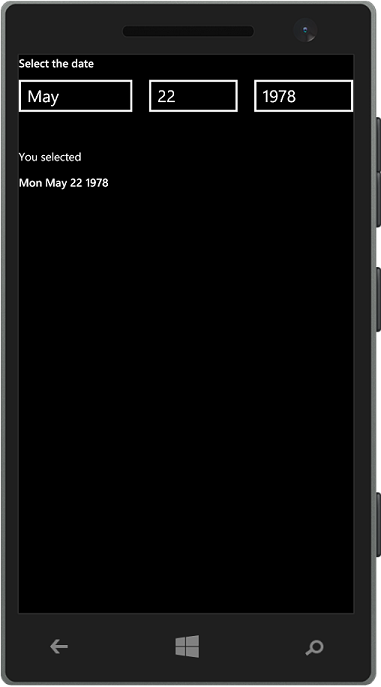

Javascript WinPhone DatePicker
==============================

For some unknown (by me) reason [WinJS.UI.DatePicker](http://msdn.microsoft.com/en-us/library/windows/apps/br211681.aspx) is only available for Windows Store apps, not Windows Phone. (the control is also available for XAML apps).

The suggestion is have an [input element](http://www.w3.org/wiki/HTML/Elements/input/date), which I believe is awful. I also googled around for a cool Date picker but of course there are tons of controls for JavaScript but most of them are not touch oriented, and frankly the touch oriented controls I found were not very Windows Phone-like.
So I decided to create my own DateTime picker.

It's a very simple control which basically adds a `select` for every "part" of the date. Which means one for the day, one for the month, and one for the year.

This does not pretend to be a full featured control, it just meet my own needs, but I'll be glad to take pull request if you feel like contributing.

 
